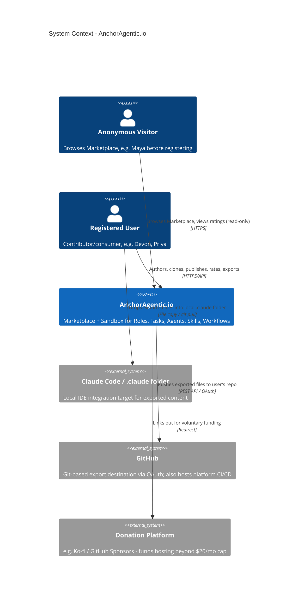
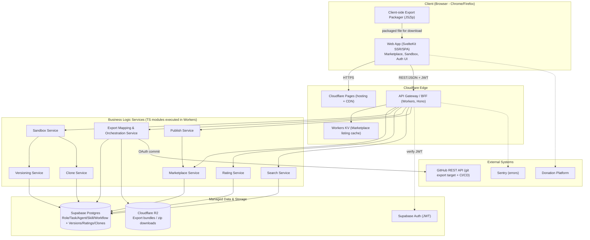
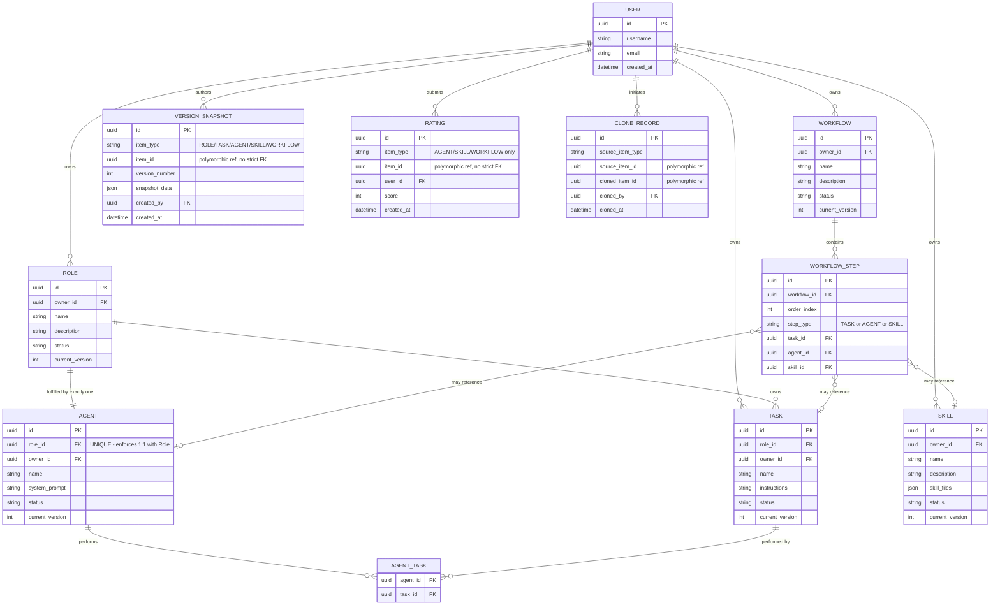
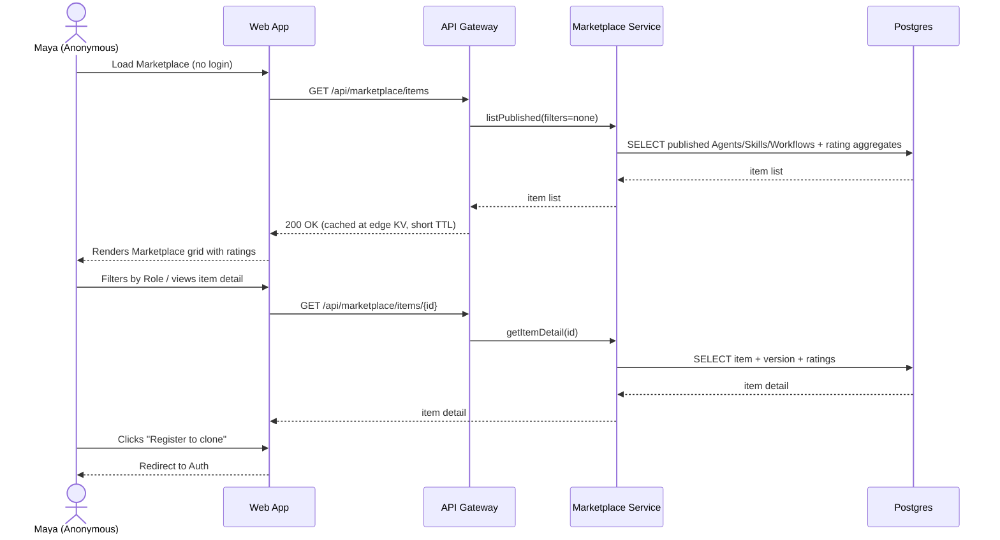
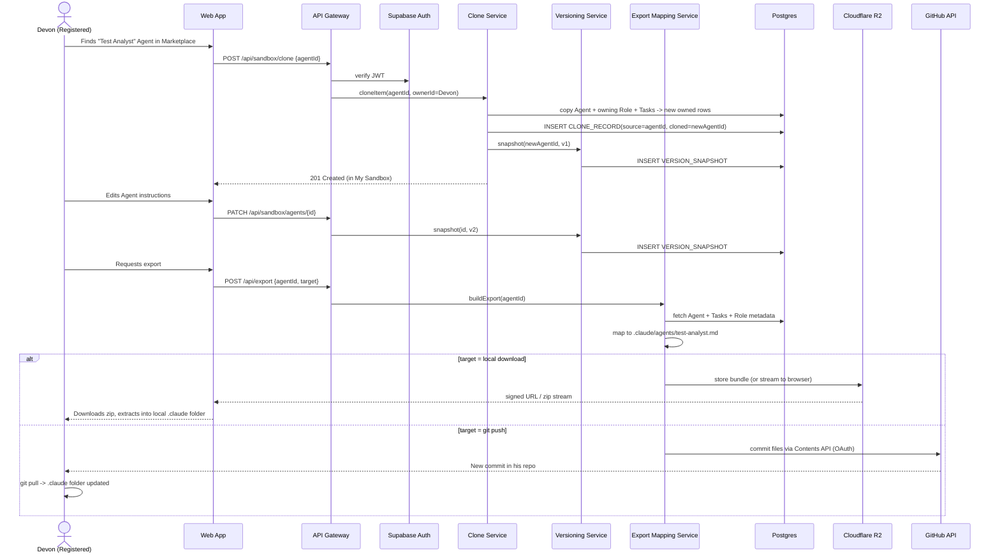
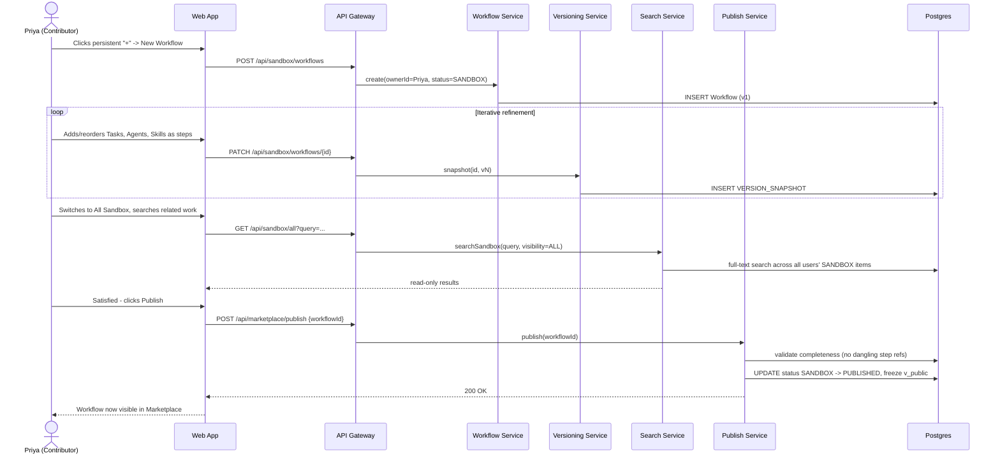
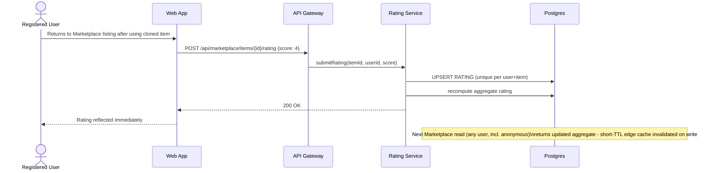
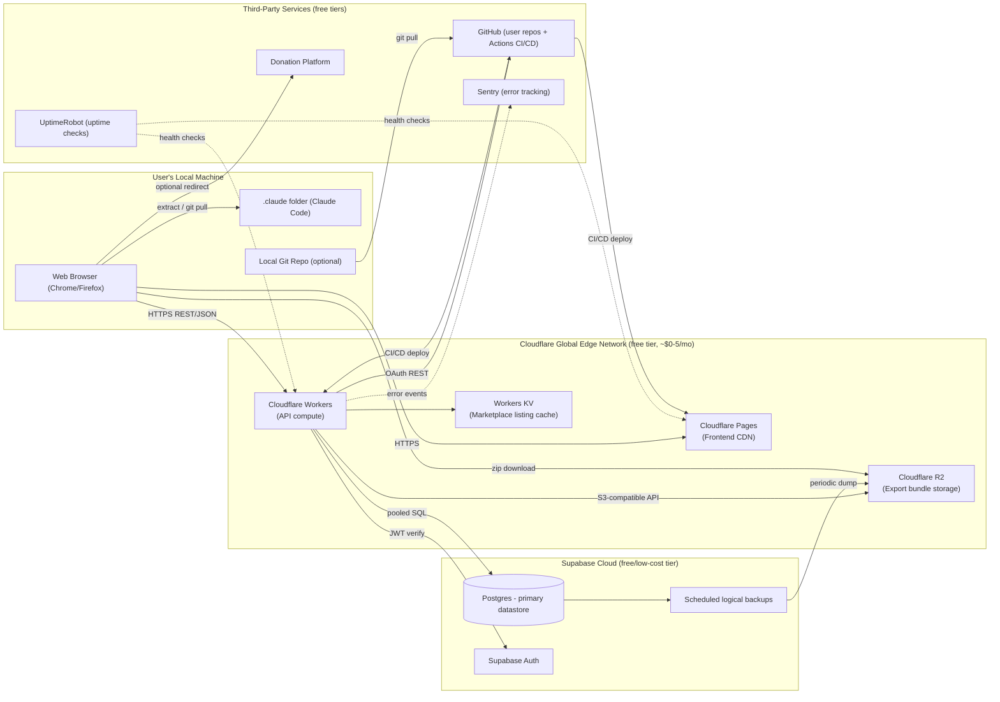
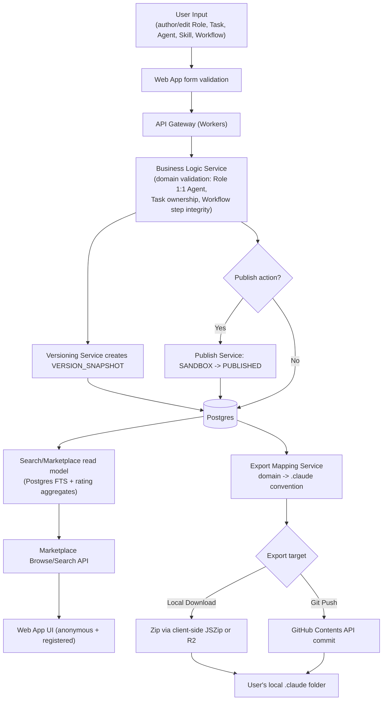
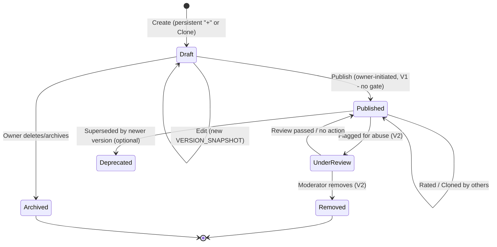

# AnchorAgentic.io — Platform Architecture

**Version:** 1.0 — 2026-09-06

---

## Executive Summary

AnchorAgentic.io is architected as a **serverless, edge-first web platform** built around a single, well-bounded domain model (Role → Task/Agent, Skill, Workflow) that must be authored, versioned, shared, and exported into Claude Code's native `.claude` folder conventions. The architecture is deliberately optimized for three forces from the product concept: (1) a **hard $20/month hosting ceiling**, (2) an **API-equal-to-UI** principle, and (3) a **native, non-lossy mapping to Claude Code's Agent/Skill conventions**.

The recommended stack — **SvelteKit on Cloudflare Pages, Cloudflare Workers as the API/BFF layer, Supabase (Postgres + Auth) as the system of record, and Cloudflare R2 for export artifacts** — keeps run-rate near **$0/month** at launch and comfortably under the $20 cap through the 1,000-registered-user, 6-month horizon defined in the product concept's success metrics. Version history is implemented as **application-level snapshots in Postgres** rather than per-item git repositories, keeping the Sandbox-to-Marketplace pipeline cheap and simple while a separate, purpose-built **Export Mapping Service** handles the genuinely git-relevant concern: pushing exported `.claude`-formatted files to a user's own GitHub repository or packaging them as a local download.

This document refines two areas of the Product Owner's hosting sketch based on architectural analysis: it replaces the general "Postgres free tier" recommendation with an explicit **Supabase-anchored design** (chosen for bundling Auth + Postgres + Storage under one free-tier ceiling, minimizing integration surface), and it flags a genuine risk in the original stack — **Cloudflare Workers' free-tier CPU-time limit (10ms)** — as a constraint on the export-packaging path, with a concrete, budget-compliant mitigation.

---

## Business Context

- **Business Goals:** Become the default starting point for individuals learning agentic SDLC practice; build a self-sustaining community content loop (user content outpacing platform defaults within year one); establish content trust via a V2 quality-gate pipeline without introducing monetization or enterprise governance.
- **User Personas:** Maya (Newcomer — needs a frictionless clone-and-learn path), Devon (Role-Gap Developer — needs trustworthy, API-exportable content that drops cleanly into his existing git/IDE workflow), Priya (Contributor/Power User — needs versioned iteration, cross-user visibility, and a low-friction publish path).
- **Success Metrics/KPIs:** See table below — directly sourced from and extended beyond the product concept's Success Metrics & Business Objectives.

---

## Key Performance Indicators (KPIs)

| KPI Category | KPI Name | Target | Measurement Method | Frequency | Owner |
|---|---|---|---|---|---|
| Business | Registered users | 1,000 | Count of `users` rows with verified email | Monthly | Product Owner |
| Business | Anonymous → registered conversion | 15% | `sign_up_events / marketplace_anonymous_sessions` (edge analytics) | Weekly | Product Owner |
| Business | Clone actions from Marketplace | 3,000 (6 mo) | Count of `CLONE_RECORD` rows sourced from `PUBLISHED` items | Weekly | Product Owner |
| Business | Monthly active registered users (return rate) | 40% | Distinct authenticated Worker requests / registered base | Monthly | Product Owner |
| Technical | API response time (Marketplace read, p95) | < 2s | Cloudflare Workers analytics / Sentry performance | Real-time | Engineering |
| Technical | Export API response time (p95) | < 5s (zip), < 8s (git push) | Worker execution duration metric | Real-time | Engineering |
| Technical | System availability | ≥ 99% monthly | UptimeRobot synthetic checks against Pages + Workers | Real-time / Weekly report | Engineering |
| Technical | Error rate (5xx per 1,000 requests) | < 5 | Sentry + Workers error logs | Real-time | Engineering |
| User Experience | Marketplace page load (LCP) | < 2s | Cloudflare Web Analytics (Core Web Vitals) | Daily | Engineering |
| User Experience | Median time: registration → first successful clone+integration | < 15 min | Event-timestamp diff (`sign_up` → `export_completed`) | Monthly | Product Owner |
| User Experience | Average Marketplace item rating | ≥ 3.5 | `AVG(RATING.score)` over `PUBLISHED` items | Monthly | Product Owner |
| Operational | Deployment frequency | ≥ 1/week (V1) | GitHub Actions deploy count | Weekly | Engineering |
| Operational | Mean time to recovery (MTTR) | < 4 hours | Incident start/resolution timestamps | Per incident | Engineering |
| Operational | **Monthly hosting spend vs. $20 cap** | < $20/mo (target $0-5) | Sum of Cloudflare + Supabase + Sentry + third-party invoices | Monthly | Founder/Product Owner |
| Operational | Sandbox items created | 2,000 (6 mo) | Count of new `ROLE/TASK/AGENT/SKILL/WORKFLOW` rows | Monthly | Product Owner |

---

## System Architecture Overview

The system follows a **layered, serverless-edge architecture**: a statically-hosted/SSR web frontend behind a global CDN, a stateless API/orchestration layer running as edge functions, a set of transport-agnostic business-logic services enforcing the domain model's invariants, a managed Postgres system of record with row-level security as a second line of defense, and an object-storage tier for export artifacts. This design maximizes free-tier coverage (compute that scales to zero, storage with free egress, managed Postgres/Auth) while keeping the domain logic decoupled enough from any single vendor to migrate if free tiers are outgrown or discontinued.

The most architecturally significant design constraint is the **domain-to-`.claude` export mapping** — Claude Code has no native concept of "Role" or "Task," so the Export Mapping Service must lossy-but-faithfully compress the platform's five-entity domain model into the two-and-a-half conventions Claude Code actually understands (Agent files, Skill folders, and Command files).



---

## Architectural Layers

### Layer 1: Presentation Layer
- **Components:** Marketplace browse/search UI, My Sandbox / All Sandbox editors, Auth screens, persistent "+" create action, client-side export packager.
- **Responsibilities:** SSR/SSG rendering of public Marketplace pages for fast anonymous first-load; authenticated SPA views for Sandbox editing and version history; client-side zip packaging for the "local download" export path (offloading that work from the edge compute budget); enforcing anonymous vs. registered UI affordances.
- **Technologies:** SvelteKit + TypeScript, deployed via `@sveltejs/adapter-cloudflare` to **Cloudflare Pages**; JSZip for client-side bundling; Tailwind CSS.

### Layer 2: Application/API Layer
- **Components:** API Gateway/BFF, Auth verification middleware, rate limiter, Export Orchestration endpoint, Search endpoint.
- **Responsibilities:** Request validation, JWT verification against Supabase Auth, routing to business-logic services, enforcing the anonymous (read-published-only) vs. registered (read-all-sandbox, write-own, rate) permission boundary at the edge before it ever reaches Postgres, translating HTTP requests into domain service calls.
- **Technologies:** **Cloudflare Workers** with the Hono routing framework (TypeScript); Workers KV for short-TTL Marketplace listing cache.

### Layer 3: Business Logic Layer
- **Components:** RoleService, TaskService, AgentService, SkillService, WorkflowService, VersioningService, CloneService, RatingService, PublishService, ExportMappingService.
- **Responsibilities:** Enforce domain invariants independent of transport — Role↔Agent 1:1, Task ownership by exactly one Role, Agent performs only Tasks belonging to its own Role, Workflow steps compose Tasks/Agents/Skills in order, every write produces a `VERSION_SNAPSHOT`, publish is a one-way `SANDBOX → PUBLISHED` transition, clone always creates a fresh owned copy plus a `CLONE_RECORD` for provenance.
- **Technologies:** Shared TypeScript domain modules imported by Worker handlers (transport-agnostic by design, so they could later run in a different compute target without rewrite); domain invariants additionally enforced at the DB layer via constraints/triggers as defense in depth.

### Layer 4: Data Access Layer
- **Components:** Postgres schema (Users, Roles, Tasks, Agents, Agent_Task, Skills, Workflows, Workflow_Steps, Version_Snapshots, Ratings, Clone_Records, Export_Jobs, Abuse_Reports [V2]), Row-Level Security (RLS) policies, full-text search indexes.
- **Responsibilities:** Persistence and referential integrity; RLS as a second enforcement point for the anonymous/registered/owner access model (so a bug in Worker-layer auth logic cannot expose private-write operations); full-text search over published + sandbox content.
- **Technologies:** **Supabase-managed Postgres** (RLS-native, connection pooling via the built-in PgBouncer pooler — required because serverless Workers open many short-lived connections); Postgres `tsvector`/GIN indexes for search; `pgcrypto` for UUIDs.

### Layer 5: Infrastructure Layer
- **Components:** Cloudflare Pages/Workers/R2/DNS, Supabase Cloud (Postgres + Auth), GitHub (CI/CD + git-export target), Sentry, UptimeRobot.
- **Responsibilities:** Global content delivery, scale-to-zero compute, managed relational database and identity, durable object storage for export bundles with free egress, automated build/deploy, error/uptime observability.
- **Technologies:** Cloudflare (Pages, Workers, R2, KV, DNS — free tier), Supabase Cloud (free/low-cost tier), GitHub Actions (free tier for this repo size), Sentry (free tier, 5k events/mo), UptimeRobot (free tier).

---

## Component Architecture



---

## Data Model



**Notes on the model:**
- `VERSION_SNAPSHOT`, `RATING`, and `CLONE_RECORD` use a **polymorphic `item_type` + `item_id` pattern** rather than five duplicated tables — see Architectural Decision #3 for the trade-off.
- Only **Agent, Skill, and Workflow** are Marketplace-publishable/ratable/clonable, matching the product concept's Marketplace feature descriptions (F-1.1, F-1.3, F-1.4, F-2.3 all name only these three types). **Role and Task are supporting entities** — authored and version-tracked in Sandbox, but referenced by Agents/Workflows rather than independently published. This is stated explicitly as an architectural interpretation in Assumptions & Constraints below, since the source doc doesn't fully disambiguate it.
- **Role is an owned, non-shared entity** scoped to its creator (not a global shared taxonomy row). The 1:1 Role↔Agent constraint is therefore enforced *per owner's content graph*, not platform-wide — two different users can each have their own "Test Analyst" Role+Agent pair. Cloning duplicates the whole Role+Task+Agent graph into the cloner's own Sandbox as new owned rows.

---

## Critical User Journeys

### Journey 1: First-Time Anonymous Discovery (Maya)



### Journey 2: Clone, Customize, and Integrate (Devon)



### Journey 3: Build, Refine, and Publish (Priya)



### Journey 4: Discover via All-Sandbox Cross-Visibility (Devon/Priya)

```mermaid
sequenceDiagram
    actor User as Devon or Priya
    participant Web as Web App
    participant GW as API Gateway
    participant Search as Search Service
    participant PG as Postgres

    User->>Web: Toggles My Sandbox -> All Sandbox
    Web->>GW: GET /api/sandbox/all?type=Agent&q=payments
    GW->>Search: searchSandbox(filters, visibility=ALL, readOnly=true)
    Search->>PG: SELECT SANDBOX items from any owner matching filters
    PG-->>Search: results (in-progress items)
    Search-->>Web: results (no edit affordances rendered)
    User->>Web: Opens a result, reads read-only detail
    Note over User,Web: Item is unpublished - cannot be cloned yet;\nuser either adapts own approach or waits for publish
```

### Journey 5: Rate and Signal Quality



---

## Deployment Architecture



---

## Data Flow



### Item Lifecycle (State Diagram)



---

## Technology Stack

| Layer | Technology | Rationale | Alternatives Considered |
|---|---|---|---|
| Frontend | SvelteKit + TypeScript on Cloudflare Pages | First-class Cloudflare adapter, smaller bundles, less edge-runtime friction than Next.js-on-Workers; SSR needed for fast anonymous Marketplace loads (<2s target) | Next.js on Cloudflare Pages (heavier, occasional edge-runtime incompatibilities); Astro (viable, slightly less suited to a highly interactive Sandbox editor); plain React SPA (no SSR, hurts anonymous first-load/SEO) |
| API Gateway/BFF | Cloudflare Workers + Hono | Scale-to-zero, generous free tier (100k req/day), colocated with Pages/R2 under one billing surface | AWS Lambda + API Gateway (more moving parts, less free-tier-friendly at this scale); Vercel Edge Functions (splits vendor surface from Cloudflare) |
| Business Logic | TypeScript domain modules (transport-agnostic) | Runs inside Workers today, portable to a small persistent service later without rewrite if Workers limits are hit | Dedicated Node/NestJS backend on a VPS (viable but forgoes free-tier compute; kept as fallback within budget) |
| Auth | Supabase Auth (JWT) | Bundled with the chosen Postgres provider; integrates directly with Postgres RLS; free tier covers 50k MAU, far beyond V1 needs | Auth0/Clerk (generous free tiers but adds a second vendor and extra integration work with RLS) |
| Database | Supabase Postgres | One vendor for Auth + DB + Storage minimizes integration surface within the $20 cap; native RLS; relational model fits versioned/linked domain entities well | Neon (excellent serverless Postgres, no Auth/Storage bundling — kept as a documented fallback if Supabase's project-pause-on-inactivity becomes an issue); Cloudflare D1 (SQLite; weaker fit for RLS-based multi-tenant access control) |
| Cache | Cloudflare Workers KV | Free-tier edge cache for Marketplace listings, colocated with API compute | Redis (Upstash free tier viable, but adds a vendor for a use case KV already covers) |
| Object Storage | Cloudflare R2 | Free egress (unlike S3) matters directly for a "download my export" feature; 10GB free tier | Supabase Storage (only 1GB free; would incur real cost as export downloads grow) |
| Search | Postgres full-text search (`tsvector`/GIN) | Sufficient for hundreds-to-low-thousands of items per NFRs; zero incremental cost | Algolia/Meilisearch (better relevance at scale, deferred to Phase 4 if search quality becomes a bottleneck) |
| Version Control Integration | GitHub REST (Contents/Git Data API) via OAuth App | Matches the stated dependency that the platform does not host git infrastructure itself; users already have/can create GitHub repos | Self-hosted git server (rejected — directly conflicts with $20 cap and stated dependency) |
| CI/CD | GitHub Actions | Free tier sufficient for this repo's size; deploys to Pages/Workers via Wrangler | GitLab CI, CircleCI (no material benefit, adds vendor) |
| Monitoring/Logging | Cloudflare Analytics + Supabase logs | Built into chosen platforms at no extra cost | Datadog/New Relic (cost-prohibitive at this budget) |
| Error Tracking | Sentry (free tier, 5k events/mo) | Purpose-built, generous free tier, easy Workers + browser SDK integration | Rollbar (comparable, no material advantage) |
| Uptime Alerting | UptimeRobot (free tier) | Simple synthetic checks against Pages/Workers, free for this scale | Better Uptime, Pingdom (paid beyond free tier at needed frequency) |
| Donation Integration | Ko-fi or GitHub Sponsors (simple link-out) | Zero integration cost; matches "donations fund infra only" constraint | Open Collective (heavier setup for marginal benefit at this stage) |

---

## Non-Functional Requirements

**Scalability:**
- Horizontal scaling: Workers auto-scale per-request at the edge with no server management; Pages serves static/SSR assets from CDN globally.
- Vertical scaling limits: Postgres compute (Supabase) is the primary ceiling; monitor connection pool saturation and query latency as the trigger to upgrade tier (still within $20 cap at low-thousands-of-users scale).
- Load balancing: Handled implicitly by Cloudflare's edge network; no dedicated load balancer needed.
- Database scaling: Start single-instance managed Postgres; add read replicas only if/when Marketplace read volume materially exceeds current-tier limits — not expected within the 1-2 year horizon in the product concept.

**Security:**
- Authentication: Supabase Auth issuing short-lived JWTs; refresh handled client-side.
- Authorization: Row-Level Security policies as the source of truth for anonymous-read-published / registered-read-all-sandbox / owner-write-own, mirrored by Worker-layer checks for defense in depth and clearer error messages.
- Data encryption: TLS in transit (enforced by Cloudflare/Supabase); encryption at rest (Supabase-managed).
- Network security: Workers act as the only externally-reachable compute surface; Postgres reachable only via Supabase's pooler, not directly exposed.
- GitHub OAuth scope: minimally scoped to `repo` contents write for the target repo only, never broader account access.
- Compliance: No specific regulatory regime (confirmed in product concept); basic data-protection hygiene given user accounts and authored content (minimal PII: username, email).

**Reliability & Resilience:**
- High availability: Cloudflare's edge network and Supabase's managed Postgres both provide standard multi-AZ-level resilience appropriate for a 99% target; no custom active-active failover needed at this scale.
- Disaster recovery: Supabase's default backup retention on lower tiers is limited — **explicit architectural decision** to add a scheduled logical `pg_dump` (via a GitHub Actions cron workflow) writing to Cloudflare R2, satisfying the product concept's explicit "irreplaceable user-generated content" backup requirement beyond default provider coverage, at near-zero incremental cost.
- Circuit breakers/retries: Export Mapping Service calls to GitHub API wrapped with exponential backoff and idempotent commit checks (avoid duplicate commits on retry).
- Health checks: UptimeRobot synthetic checks against Pages and a Workers health endpoint.

**Performance:**
- Response time targets: <2s Marketplace page loads (edge-cached listings, SSR); export operations targeted at <5-8s.
- Throughput: Comfortably covers "hundreds to low thousands of concurrent users" via Workers' scale-to-zero model.
- Query optimization: GIN/tsvector indexes on searchable fields; composite indexes on `(owner_id, status)` for Sandbox queries.
- CDN/caching: Cloudflare CDN for static assets; short-TTL KV cache for Marketplace listings, invalidated on publish/rating writes.
- Batch/long-running work: Export packaging kept intentionally lightweight (text-based content) to stay within Workers' CPU-time limits — see Architectural Decision #4.

**Maintainability:**
- Code organization: Domain services as independent, transport-agnostic TypeScript modules; Export Mapping Service isolated as a pluggable adapter (per the product concept's own stated mitigation for `.claude` convention drift).
- API versioning: `/api/v1/...` prefix from day one to allow non-breaking evolution.
- Logging/observability: Structured JSON logs from Workers, correlated via a request ID propagated through the business-logic layer.
- Configuration: Environment-based config (Wrangler environments) for dev/staging/prod.
- Documentation: Domain model, RLS policies, and the `.claude` mapping rules documented as living architecture docs alongside code.

---

## Integration Points

| Integration | Type | Protocol | Data Format | Frequency |
|---|---|---|---|---|
| GitHub (git export) | Asynchronous, user-initiated | REST (Contents/Git Data API) + OAuth | JSON / file blobs | On-demand |
| GitHub (CI/CD) | Asynchronous | GitHub Actions | YAML workflows | Per commit/deploy |
| Claude Code `.claude` folder | Offline, file-based (not a live API) | Filesystem convention (Markdown + YAML frontmatter) | Markdown/YAML | On-demand (export time) |
| Supabase Auth | Synchronous | REST + JWT | JSON | Real-time, per request |
| Supabase Postgres | Synchronous | SQL over pooled connection | SQL rows / JSONB | Real-time, per request |
| Cloudflare R2 | Synchronous | S3-compatible API | Binary (zip) | On-demand |
| Sentry | Asynchronous | HTTPS event ingestion | JSON | Real-time |
| Donation Platform | Synchronous redirect | HTTPS link-out | N/A (no API integration in V1) | On-demand |

---

## Architectural Decisions & Trade-offs

**Decision 1: Domain-to-`.claude` Export Mapping**
- Context: Claude Code has no native concept of "Role" or "Task"; only Agents (markdown sub-agent definitions), Skills (folder + `SKILL.md`), and Commands (slash-command markdown) are real conventions.
- Options Considered: (a) Invent a parallel `.claude`-adjacent format and require a translation step; (b) map every domain entity 1:1 onto some Claude Code file regardless of fit; (c) map only Agent/Skill/Workflow to real conventions and treat Role/Task as metadata inlined into those exports.
- Decision: Option (c). **Agent → `.claude/agents/<name>.md`** (with Role name/description folded into frontmatter and the Agent's Tasks inlined as an "Abilities/Steps" section in the body); **Skill → `.claude/skills/<name>/SKILL.md`** (+ supporting files) unchanged, since Skills are already first-class Claude Code citizens; **Workflow → `.claude/commands/<name>.md`**, a slash-command file that documents/orchestrates the ordered step sequence, referencing Agents/Skills by name.
- Trade-offs: Role and Task lose independent identity on export (by design — they're platform-authoring conveniences, not Claude Code primitives). This keeps the exported artifact genuinely native to Claude Code rather than inventing a competing format, directly satisfying Guiding Principle 4.
- Consequences: The Export Mapping Service is the single place that must evolve if Claude Code's conventions change — isolated deliberately (see Decision 4/Risk table).

**Decision 2: Version History as Application-Level Snapshots, Not Per-Item Git Repositories**
- Context: F-2.4 requires version history on Sandbox items; hosting real git infrastructure per item conflicts with the $20/month cap and the explicit "platform does not host git infrastructure" dependency.
- Options Considered: (a) Real git repo per item (via isomorphic-git or a git server); (b) Postgres JSONB full-snapshot or diff-based versioning.
- Decision: (b) — a `VERSION_SNAPSHOT` table storing full JSON snapshots per save, keyed polymorphically by `(item_type, item_id, version_number)`.
- Trade-offs: Loses native git tooling (blame, merge, diff visualization) in exchange for negligible storage cost and zero new infrastructure. Git-export (F-4.3) remains a distinct, separately-solved concern.
- Consequences: If the community later demands git-native history browsing, this can be added as a Phase 4 enhancement without changing the domain model.

**Decision 3: Polymorphic Association Pattern for Ratings/Clones/Versions**
- Context: Ratings, clones, and version snapshots each need to reference any of five entity types.
- Options Considered: (a) Five duplicated join/history tables (one per entity type); (b) a single polymorphic `(item_type, item_id)` pattern.
- Decision: (b), with `CHECK` constraints on `item_type` and application/trigger-level validation that `item_id` resolves to a real row of that type.
- Trade-offs: Loses native foreign-key referential integrity (a dangling `item_id` is possible if triggers are bypassed). Mitigated by keeping all writes to these tables funneled exclusively through the Versioning/Rating/Clone services, never raw SQL from elsewhere.
- Consequences: Simpler schema and fewer tables to maintain; acceptable given V1's modest scale and the mitigation in place.

**Decision 4: Cloudflare Workers (Serverless Edge) as the Primary API Compute, Not a Persistent Server**
- Context: The $20/month cap strongly favors scale-to-zero compute over a persistent VPS/Node server.
- Options Considered: (a) Cloudflare Workers; (b) Low-cost VPS (Hetzner/DigitalOcean, ~$5-6/mo) as originally sketched in the product concept.
- Decision: (a), with (b) held in reserve.
- Trade-offs: Workers' **free-tier CPU-time limit (10ms per invocation)** is a real constraint on the Export Mapping Service's zip-packaging path for larger Workflows. Mitigation: keep server-side export generation strictly to small, text-based file assembly (Agent/Skill/Workflow content is markdown/JSON, not binaries); push actual zip compression to the browser via JSZip wherever feasible; if that proves insufficient, upgrade to the Workers **Paid plan ($5/month, 50ms CPU/invocation)** — still comfortably within the $20 cap — before considering a VPS.
- Consequences: Keeps the compute layer at $0/month for the vast majority of V1 usage, with a clearly-budgeted escalation path.

**Decision 5: Role Is an Owned, Non-Shared Entity (Not a Global Taxonomy)**
- Context: The product concept states Role↔Agent is 1:1 but doesn't fully disambiguate whether "Role" is a shared reference concept or per-user content.
- Options Considered: (a) Global shared Role taxonomy (e.g., one canonical "Test Analyst" row referenced by many users' Agents); (b) Role as an owned entity, duplicated per user (including on clone).
- Decision: (b) — consistent with clone semantics (F-2.3 clones "into My Sandbox" as the user's own copy) and with Sandbox ownership model throughout the doc.
- Trade-offs: Multiple near-duplicate "Test Analyst" Roles will exist across users (some search/discovery noise), but this avoids the far harder problem of shared-taxonomy governance (who can edit a global "Test Analyst" Role definition?) which the product concept explicitly does not scope for V1.
- Consequences: Flagged in Future Considerations as a candidate V2+ enhancement (optional shared Role taxonomy) if community feedback demands more discovery consistency.

**Decision 6: Row-Level Security as a Second Enforcement Layer, Not the Only One**
- Context: The anonymous/registered/owner access model is central to the product (F-1.1, F-2.1, F-2.2).
- Options Considered: (a) Enforce access control only in the Worker/API layer; (b) enforce in Postgres RLS as well.
- Decision: (b), layered on top of (a).
- Trade-offs: Slightly more upfront schema/policy work, but prevents an API-layer bug from silently exposing private-write operations or bypassing the "Sandbox is never private but is owner-write-only" rule.
- Consequences: RLS policies become part of the reviewed artifact set for any schema change, not an afterthought.

---

## Risks & Mitigation

| Risk | Impact | Likelihood | Mitigation Strategy |
|---|---|---|---|
| Low-quality/broken content floods Marketplace in V1 (no moderation gate) | High | High | Prioritize rating visibility and sort-by-rating in Marketplace search; accelerate V2 quality-gate delivery (Phase 3 below). |
| Growth pushes hosting cost past the $20/month cap before donations ramp up | Medium | Medium | Free-tier-heavy stack (Cloudflare + Supabase) chosen specifically to hold the ceiling through early growth; surface the donation option proactively; monitor the "monthly hosting spend vs. cap" operational KPI weekly. |
| Cloudflare Workers free-tier CPU-time limit (10ms) constrains export-packaging for large Workflows | Medium | Medium | Keep server-side export text-only/small; offload zip compression to browser (JSZip); budgeted fallback to Workers Paid plan ($5/mo), still within cap (see Decision 4). |
| Supabase/Postgres free-tier project auto-pause after inactivity causes cold-start latency on first request | Low | Medium | Acceptable for a low-traffic early platform; monitor via UptimeRobot; consider a low-frequency keep-alive ping if user-perceived latency becomes a complaint. |
| Cold-start problem: empty/thin Marketplace discourages new users | High | Medium | Seed platform with curated default Agent/Skill/Workflow templates before public launch (per product concept). |
| All-Sandbox cross-visibility creates search noise given items are never private | Medium | Medium | Strong search/filter in All Sandbox (F-2.2); set clear community expectations that Sandbox = visible-by-design WIP, not a private draft space. |
| Dependency on Claude Code's `.claude` folder conventions changing over time | Medium | Low | Export Mapping Service isolated as a single, independently-versioned module (Decision 1); add fixture-based tests against known Claude Code conventions. |
| Polymorphic FK pattern allows a dangling reference if writes bypass service layer | Low | Low | All writes to Rating/Clone/Version tables funneled exclusively through dedicated services; add periodic integrity-check job as a safety net. |
| Vendor concentration on Cloudflare + Supabase | Low | Low | Business logic kept transport-agnostic (Decision 4) and Export Mapping Service isolated, easing a future migration if either free tier is discontinued or terms change materially. |

---

## Implementation Roadmap

**Phase 1: Foundation (Month 1, weeks 1-4)**
- Provision Cloudflare (Pages/Workers/R2/KV) and Supabase (Postgres/Auth) projects.
- Implement core schema + RLS policies; stand up GitHub Actions CI/CD to Pages/Workers.
- Implement Auth flows (registration/login) and the anonymous/registered permission boundary end-to-end.
- Implement scheduled logical Postgres backup to R2 (Decision/NFR above).

**Phase 2: Core V1 Features (Months 1-3, target launch end of Month 3)**
- Implement Role/Task/Agent/Skill/Workflow authoring (F-3.1–F-3.5) and domain invariant enforcement.
- Implement My Sandbox (write, versioned) and All Sandbox (read-all, searchable) (F-2.1, F-2.2, F-2.4, F-2.5).
- Implement Marketplace browse/search/publish/rate (F-1.1–F-1.4).
- Implement Marketplace Export API and Sandbox API (F-4.3, F-4.4), and the `.claude` folder export mapping (F-4.5), covering both local-download and GitHub-push paths.
- Seed the Marketplace with curated default templates to address the cold-start risk.
- Introduce the donation link-out (F-1.5) proactively, not reactively.
- **Success criteria (matches product concept):** a registered user can clone, customize, integrate into `.claude`, publish, and rate — end to end — without a moderation bottleneck.

**Phase 3: Quality & Trust / V2 (Months 4-6)**
- Automated Prompt Evaluation (F-5.1) — pre-publish content checks (e.g., structural completeness, banned-content heuristics) run as a Worker-triggered pipeline before `SANDBOX → PUBLISHED` transition.
- Automated Structure Evaluation (F-5.2) — schema/convention conformance checks (e.g., Workflow steps reference valid Tasks/Agents/Skills, Agent has a non-empty system prompt) enforced in the Publish Service.
- Optional Human Review (F-5.3) — an opt-in `UnderReview` state in the item lifecycle (see State Diagram) for creators wanting extra validation before publish.
- Abuse Reporting & Removal (F-5.4) — new `ABUSE_REPORT` table, reporting UI on every Marketplace listing, moderator removal action transitioning items to `Removed`.
- **Success criteria:** newly published content passes automated checks; abusive/broken content can be flagged and removed; average rating trends upward.

**Phase 4: Optimization (Months 7+)**
- Evaluate upgrading search (Meilisearch/Algolia) if Postgres FTS relevance/scale becomes limiting.
- Evaluate a shared/global Role taxonomy (Decision 5 revisit) based on community feedback.
- Deepen API capabilities based on Sandbox API usage data; community-health/contributor-recognition features.
- Ongoing cost monitoring against the $20 cap as the primary gate for any infrastructure change.

---

## Monitoring & Observability

- **Metrics:** Cloudflare Web Analytics + Workers analytics (request volume, latency, error rate); Supabase dashboard (DB connections, query performance).
- **Logging:** Structured JSON logs from Workers, correlated by request ID; Supabase Postgres logs for slow-query review.
- **Error Tracking:** Sentry (free tier) for both Workers and browser-side errors, with release tagging tied to CI/CD deploys.
- **Alerting:** UptimeRobot checks against Pages and a Workers health endpoint; Sentry alert rules for error-rate spikes; a **weekly automated cost-check** (Cloudflare + Supabase + Sentry usage dashboards) against the $20/month cap, escalating to the founder if projected spend exceeds ~75% of the cap — a direct architectural response to the product concept's hardest constraint.
- **Dashboards:** A founder/ops dashboard combining uptime, error rate, active users, and current monthly spend-vs-cap in one view; a product dashboard tracking the adoption/engagement KPIs above.

---

## Assumptions & Constraints

- **Assumptions:**
  - Only Agent, Skill, and Workflow are independently Marketplace-published, rated, and cloned; Role and Task are owned, version-tracked supporting entities referenced by those three, not standalone Marketplace listings (interpretation of an ambiguity in the source doc — flagged for stakeholder confirmation).
  - Role is an owned/per-user entity, not a shared global taxonomy (Decision 5).
  - Git-based export targets GitHub specifically in V1 (via OAuth + Contents API); other git hosts are out of scope until Phase 4.
  - Users bring their own Claude/LLM access and bear their own usage costs (per product concept).
- **Constraints:**
  - Hard $20/month founder-covered hosting cap; donation option introduced proactively, not only after breach.
  - No moderation/quality gating in V1 — Marketplace content quality is uncontrolled until Phase 3 (V2).
  - Browser support limited to Chrome and Firefox in V1.
  - Sandbox items are never private — enforced at both RLS and API layers, with no private/hidden mode in the data model.
- **Dependencies:**
  - Claude Code's `.claude` folder conventions and Agent/Skill formats remaining stable enough for the Export Mapping Service to track (external dependency on Anthropic's tooling).
  - Users having or being able to create their own GitHub repository for the git-export path.

---

## Future Considerations

- Multi-git-host support (GitLab, Bitbucket) beyond the V1 GitHub-only assumption.
- Revisit whether Role should become an optional shared/global taxonomy in V2+ for more consistent cross-user discovery (Decision 5).
- Upgrade version history from application-level snapshots to real git objects if community demand for native git tooling (blame/merge) emerges.
- Dedicated search service (Meilisearch/Algolia) if Postgres full-text search relevance or scale becomes limiting.
- Formal accessibility audit against WCAG 2.1 AA (flagged as aspirational-but-unconfirmed in the product concept) once UI design is finalized.
- Localization beyond English-only V1, if community demand emerges.
- Lightweight community norms/code-of-conduct for V1, given moderation is fully deferred to Phase 3 — an open product question the architecture doesn't need to block on, but the Abuse Reporting schema (Phase 3) should be designed with this in mind from the start.
- Which donation platform to integrate operationally (Ko-fi vs. GitHub Sponsors vs. Open Collective) — a low-architectural-impact decision that can be made close to launch.

---

## References

- Claude Code Agent/Skill/Command conventions (Anthropic documentation) — target format for the Export Mapping Service.
- C4 Model (Simon Brown) — used for the System Context diagram.
- PostgreSQL Row-Level Security documentation — basis for the access-control enforcement pattern.
- Cloudflare Workers limits documentation — basis for Decision 4's CPU-time mitigation.
- GitHub REST API (Contents/Git Data API) documentation — basis for the git-export integration.
- WCAG 2.1 AA — aspirational accessibility baseline flagged in the product concept.
- Source input: `C:\dev\flow_model_generator_claude_code\docs\PRODUCT-CONCEPT.md` (Product Owner Agent deliverable, v0.2).

---

This deliverable is ready for handoff to the Business Analyst Agent (for detailed user stories/acceptance criteria against this architecture) and to engineering for Phase 1 kickoff. Two items are flagged above for lightweight stakeholder confirmation rather than blocking: (1) the Role/Task-are-not-independently-published interpretation, and (2) the Role-as-owned-not-shared interpretation — both documented as explicit assumptions so they can be revisited without architectural rework if incorrect.
